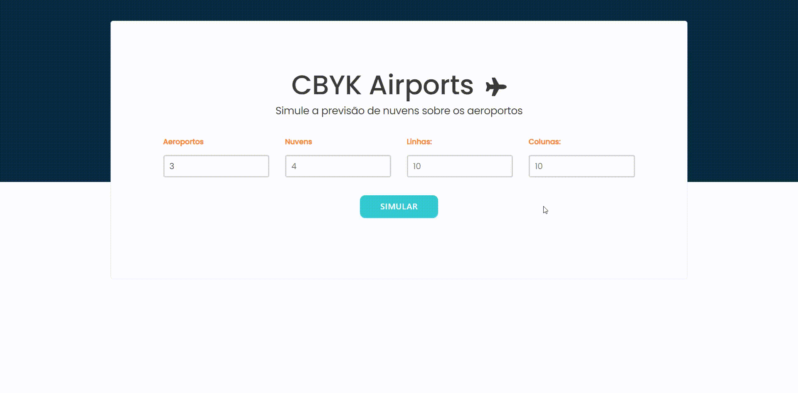

<h1 align="center">
    
</h1>

<h4 align="center">
  CBYK | Airports
</h4>

<p align="center">
  <a href="#-project">Project</a>&nbsp;&nbsp;&nbsp;|&nbsp;&nbsp;&nbsp;
  <a href="#rocket-techs">Techs</a>&nbsp;&nbsp;&nbsp;|&nbsp;&nbsp;&nbsp;
  <a href="#rocket-Running">Running</a>&nbsp;&nbsp;&nbsp;|&nbsp;&nbsp;&nbsp;
</p>
<br>

## 💻 Project

 This project was built as a proof of knkowlegment in web developement techs
 This test was provided by the company **CBKY (https://cbyk.com.br/)**.


## :rocket: Techs

- [ReactJS](https://reactjs.org/)
- [React Bootstrap](https://react-bootstrap.github.io/)
- [Styled Components](https://styled-components.com/)
- [Axios](https://www.npmjs.com/package/axios)


## :notebook: Running

### Requeriments

```bash
# Clone this
$ git clone https://github.com/glauberbrack/cbyk-web

# Go to your project folder
$ cd cbyk-web

# Install all depencies
$ yarn install

# Run your project
$ yarn start

```

---

☕ Glauber Brack - <a href="mailto:glauber@brack.com.br?Subject=Hello%20you">Talk to me!</a>
